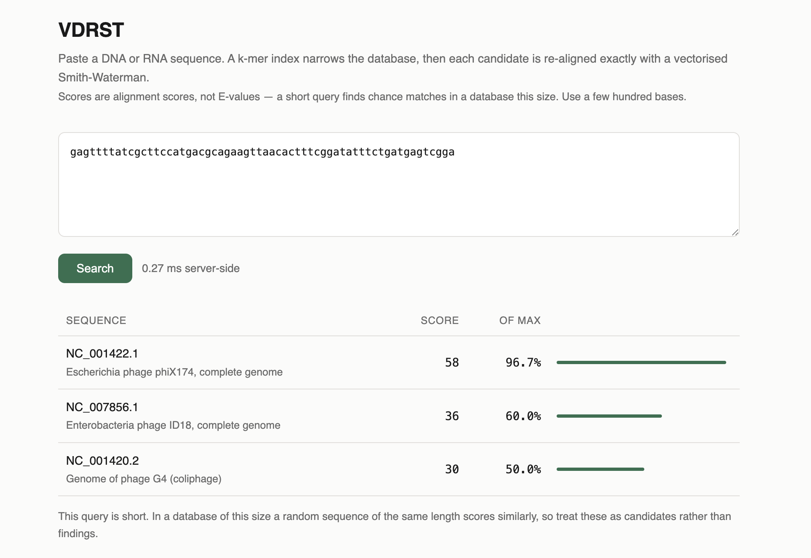

# VDRST

Low-latency viral sequence search. A k-mer index narrows NCBI-style reference genomes to a
few candidates, then each one is re-aligned exactly with a vectorised Smith-Waterman.

**p50 0.32 ms, p99.9 0.76 ms** against NCBI's real `ref_viruses_rep_genomes` — 18,703
genomes, 552 million bases — on a plain M1 laptop. That is 30x faster than v2.0 on the
same machine; on the reproducible synthetic corpus, the full benchmark ladder spans
68,333x from the unfiltered baseline.

### [Try it →  vdrst-hujiawei.australiaeast.cloudapp.azure.com](https://vdrst-hujiawei.australiaeast.cloudapp.azure.com)

Live against the real database — all 18,802 genomes and 554,893,834 bases of NCBI's
current `ref_viruses_rep_genomes`, indexed in memory. Paste a few hundred bases of any
viral sequence, or borrow one from the examples below.

Written in 2024 as my first project. Rebuilt in 2026 with benchmarks, tests, and
[a written retrospective](RETROSPECTIVE.md) of everything the first version got wrong. The
original is preserved at [`v1.1-2024-complete`](../../tree/v1.1-2024-complete). Optimised
again later in 2026 — v2.1, this page — which is also when it met real data for the first
time, and real data found two bugs the synthetic corpus never could. Both are documented
below, because finding them is what the benchmarks and tests are *for*.

Zero external dependencies. Java 21 and a JDK are the whole toolchain.

---

## Benchmarks

Each row changes exactly one thing from the row above it, so the difference between two
rows has a single cause. Reproduce with `make corpus && make bench` — the corpus is
generated from a fixed seed, so these numbers come back the same on any machine of similar
speed, with nothing to download.

| | prefilter | re-rank | p50 | p99 | p99.9 | vs B0 |
|---|---|---|---:|---:|---:|---:|
| **B0** | none | v1 Smith-Waterman | 23,816.71 ms | — | — | 1x |
| **B1** | blastn subprocess | v1 Smith-Waterman | 974.41 ms | — | — | 24x |
| **B2** | blastn subprocess | Gotoh affine | 996.31 ms | — | — | 24x |
| **B3** | k-mer index | Gotoh affine | 9.59 ms | 10.18 ms | 42.99 ms | 2,484x |
| **B4** | k-mer index | Gotoh banded | 6.95 ms | 7.57 ms | 14.52 ms | 3,426x |
| **B5** | k-mer index | SIMD, 32-bit lanes, masked *(v2.0)* | 8.91 ms | 47.71 ms | 190.72 ms | 2,675x |
| **B6** | k-mer index | SIMD, 16-bit lanes, maskless | 1.03 ms | 1.16 ms | 1.44 ms | 23,026x |
| **B7** | k-mer index | B6, candidates scored in parallel *(v2.1)* | **0.35 ms** | **0.63 ms** | **0.87 ms** | **68,333x** |

`B0` is the honest baseline: what "search the database with Smith-Waterman" costs when
nothing narrows the candidate set first. `B1` is the pipeline v1 actually shipped. `B5` is
what v2.0 shipped. `B7` is what runs today — **25x faster than v2.0 at the median on this
machine, and 219x faster at p99.9.**

<sub>OpenJDK 21.0.5 (Corretto), Apple M1 (NEON, 128-bit vectors), macOS, 8 GB RAM. 500
synthetic genomes, 23,384,787 bases, seed `0x5EEDC0FFEE`. 50 queries of 300 bases. 2,000
iterations after 200 warmup for B3–B7; 50 for B1–B2; 3 for B0, which takes ~24 s per
sample. Percentiles are nearest-rank; a row reports only the percentiles its sample count
supports. blastn 2.16.0 is an x86-64 binary running under Rosetta 2 on this machine, so
B1/B2 carry translation overhead a native build would not; they are v1's pipeline as it
actually runs here, not blastn at its best.</sub>

### The machine matters, embarrassingly much

v2.0's benchmark table was measured on a Linux CI box with AVX-512. On that machine the
32-bit masked SIMD kernel (B5) was the fastest thing in the repository: p50 1.75 ms,
5.7x ahead of scalar. On this M1 the *same row* is slower than the scalar aligner it was
built to replace — p50 8.91 ms against B3's 9.59 ms is a wash, and its p99.9 of 190 ms is
the worst tail in the table.

The cause is one line: the kernel masks every load and store with `indexInRange` so the
last, partial vector of an anti-diagonal stays in bounds. Under AVX-512, a mask is a
predicate register and close to free. NEON has no predicate registers, so the JIT quietly
turns every masked operation into a scalar loop — and the "vectorised" kernel becomes a
scalar kernel with vector-API overhead on top.

B6 is the fix, and it is faster on *every* ISA, not just this one:

- **16-bit lanes.** Scores here are bounded by `min(query, subject) x match` — a few
  hundred, nowhere near 32-bit range. Halving the lane width doubles the lanes on every
  machine: 8 not 4 under NEON, 16 not 8 under AVX2, 32 not 16 under AVX-512. A query long
  enough to threaten 16-bit range is detected up front and delegated to the 32-bit
  kernel, so the answer is exact either way.
- **No masks anywhere.** Every vector runs at full width and the last one overhangs the
  anti-diagonal. The overhang lanes are made harmless rather than skipped: the operands
  are padded with sentinel values that equal nothing, and after each anti-diagonal one
  unmasked vector store writes border values over the cells past its end — so an overhang
  lane only ever reads what the matrix border holds, computes exactly the border value,
  and contributes nothing. The arithmetic in the real lanes is identical to the scalar
  version, which is what lets the tests demand the exact integer.

B7 then scores the 20 candidate alignments on the common pool instead of in sequence.
They are independent by construction — each touches its own window and its own thread's
scratch — so on an idle machine the alignment stage costs about one alignment's wall time
plus fork overhead. Under load the pool is busy and the stage degrades toward serial,
which is the right degradation.

### Alignment kernels

The kernels alone, at the exact shape the pipeline hands them — a 300-base query against
the 428-base window the prefilter cuts. Reproduce with `make bench-kernels`.

| | p50 | p99 | throughput |
|---|---:|---:|---:|
| `legacy-v1` — v1's, full `int[][]`, linear gaps | 447.04 µs | 581.33 µs | 287 Mcells/s |
| `gotoh-affine` — affine gaps, rolling buffers | 468.96 µs | 790.88 µs | 274 Mcells/s |
| `gotoh-banded-64` — band from the seed diagonal | 343.92 µs | 413.04 µs | 373 Mcells/s |
| `gotoh-simd-4lane` — 32-bit lanes, masked *(v2.0)* | 438.63 µs | 851.29 µs | 293 Mcells/s |
| `gotoh-simd16-8lane` — 16-bit lanes, maskless *(v2.1)* | **47.96 µs** | **60.83 µs** | **2,677 Mcells/s** |

Same machine, same 1,500 samples each. The masked kernel ties the scalar one at the
median and loses to it at p99; the maskless 16-bit kernel is 9.1x faster than the masked
one, 9.8x faster than the scalar one, and its p99 sits closer to its own median than any
other row's. Exactness is not traded for
any of this: `AlignerEquivalenceTest` demands every kernel return the *same integer* as
a deliberately naive three-matrix reference, across randomised inputs, four scoring
schemes, sequences containing N, and lengths straddling every lane-count boundary.

### Where the time goes

The latency budget from the final run, with the alignment stage measured serially so the
split is clean:

```
k-mer prefilter             0.067 ms    6.6%
alignment (20 candidates)   0.958 ms   93.4%     0.28 ms wall time when scored in parallel
```

Both stages moved in v2.1. The aligner got the headlines above. The prefilter's own 10.6x
— 0.708 ms median before the selection rewrite, 0.067 ms after, same machine, same corpus,
2,000 samples each — came from paying for what a query actually touches instead of what
the scratch tables could hold: walking live table entries instead of table capacity,
sorting packed primitives instead of comparator-sorted records, and de-duplicating genomes
with a generation counter instead of a fresh 18 KB `boolean[]` per query. None of it is
clever; all of it was on the only path a request ever takes.

---

## The real database

Everything above uses the seeded synthetic corpus, because it reproduces anywhere in
minutes. v2.1 is also benchmarked against the real thing: NCBI's
`ref_viruses_rep_genomes`, the reference viral genome database — **18,703 sequences,
552,047,339 bases**, from influenza to a 2.4-megabase orpheovirus.

```
make bench JAVA_OPTS="-Xms3g -Xmx3g" \
  ARGS="--db ref_viruses.fasta --k 13 --stride 2 --sample-queries 50 --skip-baseline --skip-blast"
```

Queries are 50 windows drawn from the database itself with a fixed seed, then mutated
with 3% substitutions and two short indels each — a related isolate rather than a perfect
copy, so the aligner has real differences to charge for.

| | p50 | p99 | p99.9 | vs v2.0 config |
|---|---:|---:|---:|---:|
| B3 k-mer + Gotoh affine | 9.51 ms | 11.28 ms | 30.55 ms | |
| B5 k-mer + SIMD 32-bit masked *(v2.0)* | 9.64 ms | 55.20 ms | 177.89 ms | 1x |
| B7 k-mer + SIMD 16-bit parallel *(v2.1)* | **0.32 ms** | **0.46 ms** | **0.76 ms** | **30x / 120x / 234x** |

<sub>Same machine and JVM as above. Index: k=13, stride 2, 275,804,229 positions, 1.3 GB,
built in 24 s at startup; the 560 MB FASTA loads in 2.2 s. 2,000 iterations after 200
warmup.</sub>

Over HTTP the story holds: 1,000 keep-alive requests against `localhost:9090` with real
300-base queries measure **p50 0.83 ms wall time** end to end, of which the search itself
is 0.48 ms and the rest is HTTP, JSON and loopback.

### On the public deployment

The live service runs the same code on a 2-vCPU Azure VM in Australia East, and reports
its own server-side time in every response. Measured from a laptop in New Zealand:

| | |
|---|---:|
| server-side search, as reported by the service | **1.0–1.6 ms** |
| wall time, connection reused | 36–82 ms |
| wall time, new TLS connection each request | 112–154 ms |

The gap is the Tasman Sea, not the search. Roughly 30 ms of every request is the
round trip to Sydney and back, and a fresh TLS handshake costs two more of them — so the
honest way to read the table is that the network is two orders of magnitude more
expensive than the thing this project optimises. The server-side number is the one the
benchmarks above are about; it is quoted separately here precisely so the two are not
blended into a single flattering figure.

One thing the cloud machine does better than the laptop: its AMD cores carry AVX2, so
the 16-bit kernel gets **16 lanes per vector instead of the M1's 8**. Same source, same
`ShortGotohAligner`, twice the lanes — which is the payoff for the maskless design that
this page's benchmarks section is mostly about.

The public deployment is bounded, because a search is priced in CPU and a public URL
attracts more than curiosity — the machine's first scanner probe arrived within twelve
minutes of the port opening, looking for WordPress endpoints. It answers 30 requests per
minute per client and caps queries at 5,000 bases; both are flags, and both default to
off, because a service on localhost has no door to guard.

### Three real answers

The reason to run against real data is that correctness claims get teeth. Three queries,
three correct phylogenetic neighbourhoods, straight from the running service:

A SARS-CoV-2 fragment returns SARS-CoV-2, then SARS, then a bat sarbecovirus:

```json
{"subjectId":"NC_045512.2","title":"Severe acute respiratory syndrome coronavirus 2 isolate Wuhan-Hu-1, complete genome","alignmentScore":189}
{"subjectId":"NC_004718.3","title":"SARS coronavirus Tor2, complete genome","alignmentScore":109}
{"subjectId":"NC_014470.1","title":"Bat coronavirus BM48-31/BGR/2008, complete genome","alignmentScore":82}
```

300 bases of influenza A HA return their own reference at the maximum possible score,
then the 2009 pandemic H1N1:

```json
{"subjectId":"NC_002017.1","title":"Influenza A virus (A/Puerto Rico/8/1934(H1N1)) segment 4, complete sequence","alignmentScore":300,"normalizedScore":1.0000}
{"subjectId":"NC_026433.1","title":"Influenza A virus (A/California/07/2009(H1N1)) segment 4 hemagglutinin (HA) gene, complete cds","alignmentScore":116}
```

300 bases of HIV-1 return HIV-1 at the maximum score, then HIV-2, then SIV — the
neighbourhood a virologist would draw by hand.

And the interface, mid-query:



<sub>60 bases of phiX174 — the first genome ever sequenced — against the full real
database: 0.27 ms for this request. A single 60-base query is about a fifth of the
benchmark's 300-base standard, which is why one observation can land under the 0.32 ms
median; the tables above quote medians over 2,000 runs, never single observations like
this one. The note under the results is the interface itself flagging that a query this
short finds matches by chance.</sub>

### What real data broke

The synthetic corpus is seeded, uniform and polite. NCBI's database is none of those
things, and pointing v2.1 at it surfaced two real bugs within the hour:

1. **The diagonal accumulator could hang.** A 300-base query is 290 k-mers at up to 512
   occurrences each — up to 148,480 seed hits, most landing on distinct diagonals in a
   large database. The accumulator was a fixed-size open-addressed table, and an
   open-addressed table that fills does not degrade, it stops: the probe loop has no free
   slot to find. It now doubles past half load. The synthetic corpus never came within an
   order of magnitude of filling it.

2. **A match at the very start of a genome could be attributed to the wrong genome.**
   Diagonals are binned in groups of 16 and the bin rounds down, so an alignment starting
   within 15 bases of a genome boundary resolved into the record *before* it. An HIV-1
   query found its own reference — at a third of the correct score, via the genome's 3'
   LTR repeat — because the real 5' hit had been credited to the neighbouring record.
   Genomes are now resolved from a stored seed position, which cannot be outside its own
   genome, and the regression test plants a boundary at 37 — deliberately not a multiple
   of 16 — and fails against the old code.

Both fixes landed with tests. The lesson is v1's lesson again, one layer up: a pipeline
proven against data shaped like your assumptions has been proven against your assumptions.

---

## How it works

```
  sequence
     │
     ▼
  validate ─────────────── reject non-nucleotides, bound the length
     │
     ▼
  k-mer index ──────────── every k-mer of the query looked up in a
     │                     direct-addressed CSR table; seed hits collected
     │                     by alignment diagonal; strongest diagonals win
     │                     ~0.04–0.07 ms, bounded work per query
     ▼
  20 candidates ────────── a window of each genome, cut around its diagonal
     │
     ▼
  Gotoh SIMD ───────────── exact affine-gap Smith-Waterman, 16-bit lanes,
     │                     no masks, all 20 candidates scored in parallel
     │                     ~0.3 ms wall time
     ▼
  top 3
```

**The prefilter** is a direct-addressed k-mer table in CSR layout. With k = 11 there are
4^11 buckets, so the k-mer *is* the bucket number: no hashing, no collision handling, no
boxing. A lookup is one indexed read and a sequential walk. Seed hits are accumulated by
alignment diagonal in an open-addressed table of flat `int[]`s that doubles when it passes
half load, retired between queries by a generation counter rather than by clearing.
Per-query scratch is per-thread and reused, so a steady-state search allocates only its
result list and the candidate windows.

Work per query is bounded: a k-mer occurring more than 512 times in the database is a
repeat, distinguishes nothing, and is skipped. That costs a little sensitivity on
low-complexity input and buys a ceiling on the tail.

**The aligner** is Smith-Waterman with affine gap costs (Gotoh 1982), vectorised along
anti-diagonals rather than in Farrar's striped layout. The dependency that makes
Smith-Waterman awkward to vectorise runs along a row — `E[i][j]` needs `E[i][j-1]` — and
Farrar works around it with a fix-up pass whose cost depends on the data. Cells on one
anti-diagonal have no such dependency: everything a cell on diagonal *d* needs lives on
*d-1* or *d-2*. So an anti-diagonal is one pass of independent lanes, with no fix-up, no
data-dependent branch — and, since v2.1, no masks: the last vector overhangs the diagonal
into sentinel-padded territory arranged so overhang lanes compute exactly the border
values. Lanes are 16-bit because scores are provably small; queries that could overflow
are delegated to the 32-bit kernel.

That last point is what makes it testable. `AlignerEquivalenceTest` demands the
vectorised, banded and scalar implementations return the *same integer* as a deliberately
naive three-matrix reference, across randomised inputs and four scoring schemes. Without
it, "9x faster" and "9x faster and quietly wrong" look identical from the outside.

---

## Running it

Needs a JDK 21+. Nothing else — no Maven, no network, no BLAST.

```bash
make corpus          # generate the seeded database (once, ~1 min)
make test            # 57 tests against a real index over real sequence data
make bench           # reproduce the staged table above
make bench-kernels   # reproduce the per-kernel table
make run             # http://localhost:9090
```

Or:

```bash
make corpus && docker compose up
```

The server warms itself up before the port opens — 300 searches over windows drawn from
its own database — so the first request meets a fully compiled pipeline instead of paying
the JIT tax a benchmark never shows. `--warmup 0` disables it.

### API

```bash
curl -X POST localhost:9090/search \
  -H 'Content-Type: application/json' \
  -d '{"sequence":"ACGTACGT..."}'
```

```json
{
  "elapsedMs": 0.753,
  "matches": [
    {
      "subjectId": "NC_002017.1",
      "title": "Influenza A virus (A/Puerto Rico/8/1934(H1N1)) segment 4, complete sequence",
      "subjectLength": 1778,
      "alignmentScore": 300,
      "normalizedScore": 1.0000,
      "subjectOffset": 0,
      "seedHits": 144
    }
  ]
}
```

`normalizedScore` is the alignment score as a fraction of the best this query could achieve
against a perfect copy of itself. It is comparable between queries of similar length, which
[v1's "percentage" was not](RETROSPECTIVE.md#8-a-percentage-that-could-not-be-compared-to-anything)
— but see Limitations below before reading it as sequence identity, which it is not.

### Limitations

**No E-values.** Results carry an alignment score, not a statistical significance. That
matters more than it sounds: in a database of hundreds of millions of bases there is
enough sequence that a *random* 20-mer finds something scoring around 70% of its maximum.
Without an E-value there is nothing in the output separating that from a real hit, so
queries below 30 bases are rejected outright and the interface says plainly that short
queries find matches by chance. A proper Karlin-Altschul E-value is the honest fix and is
not implemented; this is a threshold standing in for a significance test.

**`normalizedScore` is not percent identity.** It is score over the maximum attainable
score for that query. With a match reward of 1 the two look similar for a well-aligned
query and diverge as soon as gaps or mismatches appear.

**Banding is a heuristic.** An indel wider than the 64-base band can push part of an
alignment out of the searched region. `BandedAlignerTest` pins both sides of that trade.
The default aligner is unbanded.

**Repeat k-mers are skipped.** A k-mer occurring more than 512 times is treated as carrying
no signal. That bounds worst-case latency and costs sensitivity on low-complexity queries.

**IUPAC ambiguity codes fold to N.** Real databases contain them — `ref_viruses_rep_genomes`
has 9,885 in the December 2024 volumes and 10,197 in the current ones — and folding keeps
them out of the index without pretending to know which base they were. The count is
reported at startup. Query-side validation stays strict.

**The public deployment is bounded.** 30 requests per minute per client, queries capped at
5,000 bases. Alignment cost grows with the square of the query, so an uncapped 16,000-base
request measured close to two seconds of CPU on the live service. Both bounds are flags
and both default to off; a private instance has neither.

### Deploying it

`deploy/cloud-init.yaml` provisions a host from nothing: JDK 21, the real NCBI database
fetched from the FTP archive and exported to FASTA, the service under systemd, and Caddy
in front for automatic TLS. It is the file the live deployment was built from, with the
three things that went wrong the first time already fixed in it — Caddy needs its own apt
repository, its config file cannot be written before the package is unpacked (dpkg asks
about the conflict, and an unattended install has nobody to answer), and Ubuntu does not
ship `update_blastdb.pl`.

```bash
az vm create --resource-group vdrst-rg --name vdrst-vm \
  --image Ubuntu2404 --size Standard_B2als_v2 \
  --admin-username azureuser --ssh-key-values ~/.ssh/your_key.pub \
  --public-ip-address-dns-name your-label \
  --os-disk-size-gb 64 --custom-data deploy/cloud-init.yaml --nsg-rule NONE
```

Change the domain in the staged `Caddyfile` to your own, open 80 and 443, and the host
brings itself up: about 15 minutes, most of it the 190 MB database download and the 28 s
index build. 2 vCPU and 4 GiB is enough for the full real database at `k=13, stride 2`.

### Serving the real database

```bash
# If you do not have it yet (this part needs BLAST+):
update_blastdb.pl --decompress ref_viruses_rep_genomes

# A BLAST database is a set of binary index files. v2 has no BLAST dependency and reads
# sequences directly, so export it to FASTA once:
make fasta DB=/path/to/ref_viruses_rep_genomes

make run JAVA_OPTS="-Xms3g -Xmx3g" \
         ARGS="--db /path/to/ref_viruses_rep_genomes.fasta --k 13 --stride 2"
```

After that one export, nothing in VDRST needs BLAST installed. The 560 MB FASTA loads in
about 2 s and the index builds in about 24 s, printed stage by stage.

**Memory.** The index costs about 4 bytes per indexed position plus the sequences plus
the bucket table (`4^k x 4` bytes). At `k=13, stride 2` the full real database fits in
about 1.9 GB — the setting used for every real-database number on this page, chosen to
fit an 8 GB laptop. With more memory, `--stride 1` indexes every position and buys back a
little sensitivity for twice the positions. Startup prints the estimate before allocating
anything. Raising `k` from 11 to 13 multiplies the bucket count by 16, which on a
552-megabase database is what keeps the average bucket walk short.

Both prefilters are behind one interface, so `blastn` remains available as a cross-check —
`KmerPrefilterTest` asserts the in-process index agrees with it on the top candidate for
every query. Agreeing with thirty years of NCBI's work is a stronger claim than agreeing
with expectations this repository wrote itself.

---

## Layout

```
src/main/java/vdrst/
  align/     scoring, encoding, and five Smith-Waterman implementations
  index/     genome store, k-mer index, diagonal accumulator, prefilters
  service/   validation and the two-stage search
  http/      JDK HttpServer, a small JSON writer, the page
src/test/    a ~100-line test runner and 57 tests
bench/       corpus generator, the staged benchmark, the kernel benchmark
```

### Why no dependencies

v1 ran on Spring Boot 2.6.13 and carried iText, Apache POI, jsoup, org.json and a JWT
library — roughly forty jars, three with known CVEs by 2026 — to serve one endpoint that
mattered and several that [nothing could reach](RETROSPECTIVE.md#15-features-nobody-could-reach-defended-by-a-function-that-returned-true).

This is not an argument that Spring is the wrong tool. It is that a service with one route,
no persistence and no authentication was never the case for it. What is left is a Makefile,
`javac`, and the JDK: `make test` works offline on a laptop that has never seen this
project, and the Docker image needs no build stage because there is nothing to resolve.

---

## Versions

| | date | what it was |
|---|---|---|
| `v1.0-2024` | 2024 | Spring Boot + blastn subprocess + Vue, as it was public at the time |
| `v1.1-2024-complete` | 2024 | v1.0 plus three classes that never got pushed |
| `v2.0-2026` | 2026 | the rebuild: in-process index, SIMD aligner, benchmarks, tests |
| `v2.1-2026` | 2026 | this page: 25–30x v2.0, first run against the real NCBI database |

The 2024 versions are preserved unedited — including the complexity annotations I wrote at
the time, which
[turned out to be wrong in an interesting way](RETROSPECTIVE.md#11-the-complexity-analysis-used-one-letter-for-two-things).
Two mechanical edits were applied to that history and nothing else: a live database
password was redacted, and `node_modules/` and build output were removed. No source logic
was altered.

---

## Credits

Front-end, back-end, algorithms and this rewrite: **Hu Jiawei (David)**.

The 2024 prototype design was by **Tang Bingni**. Domain guidance on viral genomics came
from **Tan Ke Qi**, **Teh Wen Xuan**, **Commettant Neil Jude** and **Huang ZhouXiang**, who
work in the field and were generous with their time.
